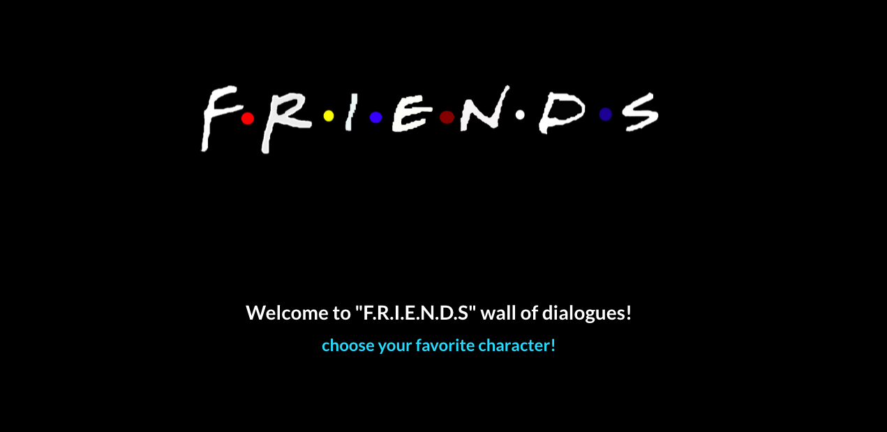

## Who hasn't watched FRIENDS?

Well, FRIENDS could not <em>be</em> any better for a funny little TV series.

### What does the application do?

This project is a naive attempt to familiarize with the events in js.  
All it does is to capture the click event on the viewport of screen and display a random phrase from a list of phrases for a particular character from the series FRIENDS at the point the screen was clicked.

### Planning to run it on your local?

Use these steps:  

<ol> 
<li> Install the packages using: <code>`npm i`</code> in the root folder </li>
<li> Build the project using: <code>`npm run build`</code> so that you can resolve errors <em>if any</em></li>
<li> Get the application running using: <code>`npm run start`</code> and the application runs on the port 3005 </li>
</ol>

> Note: The port can be changed in <code>`.env`</code> file

### Deployment

This application is hosted on github using <em>github pages</em>

